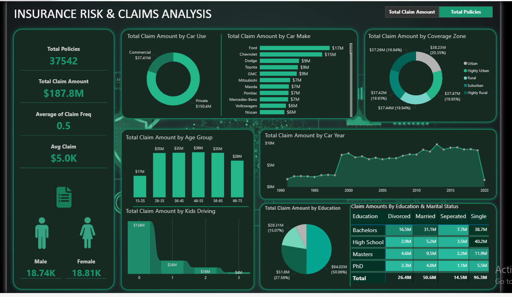
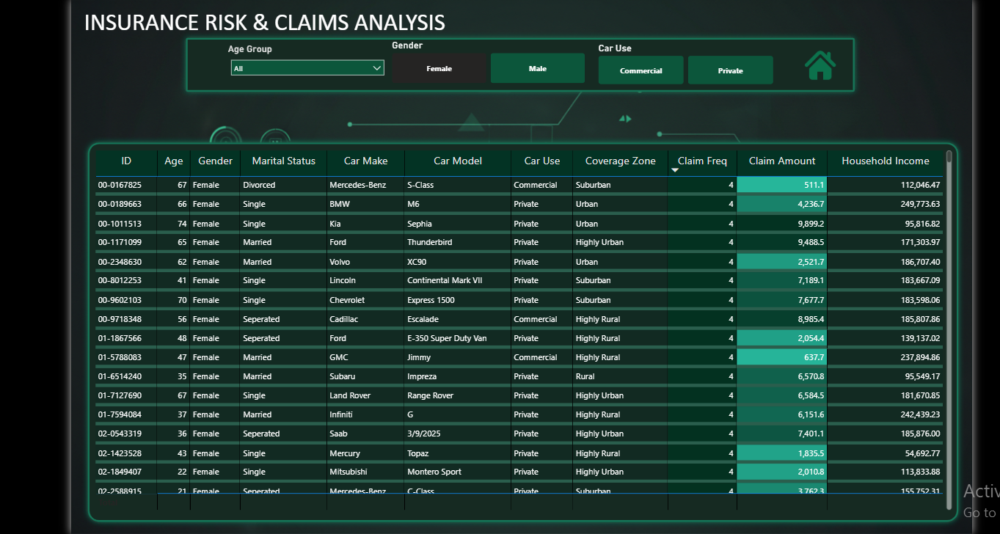

## 📷 Dashboard Preview

Insurance Risk & Claims Analysis Dashboard
📌 Business Requirement

An insurance company needed a centralized interactive dashboard to better understand its policyholder base and claim patterns.
Policy and claims data were previously scattered across multiple sources, making it difficult to monitor performance and identify trends.

The objective was to build a Power BI dashboard that provides:

Clear KPI tracking

Risk segmentation

Demographic and behavioral analysis

Interactive dynamic reporting

📊 KPI Metrics

The dashboard includes the following key performance indicators:

Total Policies – Measures the size of the customer base

Total Claim Amount – Overall financial exposure

Claim Frequency – Indicates how often claims occur

Average Claim Amount – Measures claim severity

Gender-wise Policy Distribution – Customer segmentation

📈 Visual Analysis

All visualizations are built around two dynamic core measures:

Total Claim Amount

Total Policies

A Dynamic Measure Parameter (Select Measure) was implemented to allow users to switch between both measures across all visuals, enabling flexible and comparative analysis.

Visual Breakdown:

Donut Chart – By Car Use

Bar Chart – By Car Make

Donut Chart – By Coverage Zone

Histogram – By Age Group

Area Chart – By Car Year

Ribbon Chart – By Kids Driving

Pie Chart – By Education

Matrix Heat Grid – Education × Marital Status

🧠 Key Insights Enabled

The dashboard allows stakeholders to:

Identify high-risk vehicle brands

Detect demographic segments with higher claim frequency

Analyze regional risk exposure

Evaluate the impact of young drivers on claims

Understand behavioral risk patterns

🛠 Tools Used

Power BI

DAX Measures

Field Parameters (Dynamic Measure Selection)

Interactive Filtering & Slicers

🎯 Project Objective

To transform raw insurance data into actionable insights that support pricing strategies, risk management decisions, and customer segmentation.

