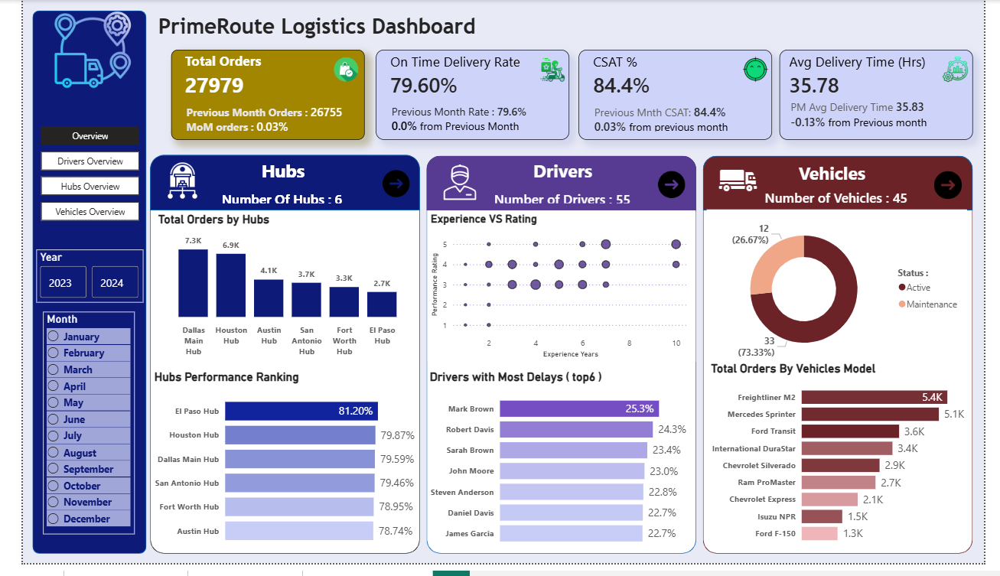
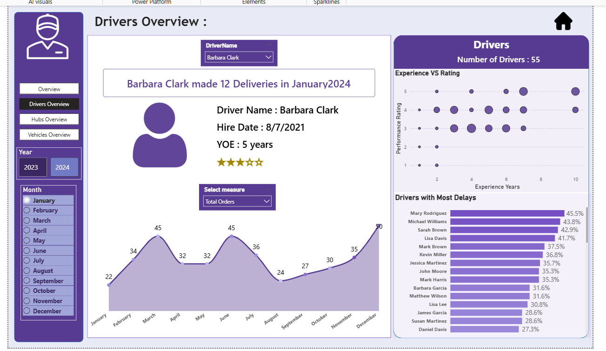
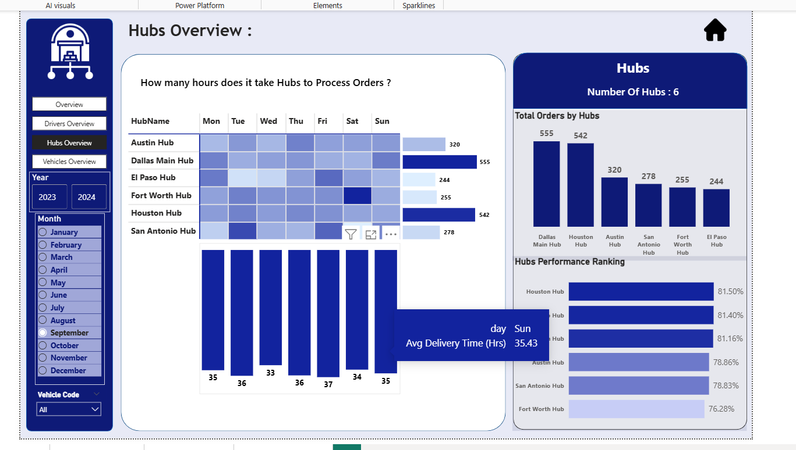
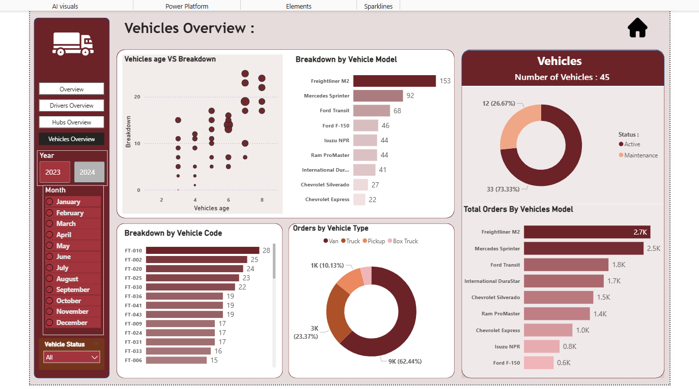

# 🚚 PrimeRoute Logistics Performance Dashboard

## 📋 Project Overview
**PrimeRoute Logistics** is a high-end data analytics solution developed in **Power BI** to streamline supply chain operations. This dashboard transforms complex logistics data into actionable insights, focusing on operational efficiency, fleet health, and driver performance.

## 📸 Dashboard Preview

### 1. Executive Overview
Comprehensive view of core business KPIs and Month-over-Month (MoM) performance.

### 2. Drivers Analytics
Deep dive into driver efficiency, performance ratings vs. experience, and delay analysis.

### 3. Hub Operations
Analysis of processing hours and delivery times across different regional hubs.

### 4. Fleet & Vehicles Maintenance
Monitoring fleet status, breakdown frequency by vehicle age, and model-specific reliability.

---

## ✨ Key Features
* **Dynamic Navigation:** Custom-built side sidebar for seamless switching between analytical views.
* **Operational KPIs:** Tracking **On-Time Delivery Rate (79.6%)**, **CSAT (84.4%)**, and **Average Delivery Time**.
* **Advanced Analytics:** Correlation analysis between driver experience and performance ratings.
* **Fleet Health Tracking:** Visualizing breakdown patterns to improve preventive maintenance schedules.

## 🛠️ Technical Stack
* **Analytics Tool:** Power BI Desktop
* **Data Modeling:** Optimized Star Schema.
* **DAX (Data Analysis Expressions):** Specialized measures for Time Intelligence (MoM Growth), conditional formatting, and ranking.
* **Design:** UI/UX focused layout with a professional color palette and intuitive hierarchy.

## 🚀 How to use
1. Download the `.pbix` file.
2. Open with **Power BI Desktop**.
3. Use the **Navigation Pane** on the left to explore different departments.

---
**Developed as part of the Final Year Project at Faculty of Computers and Information, Ain Shams University.**
